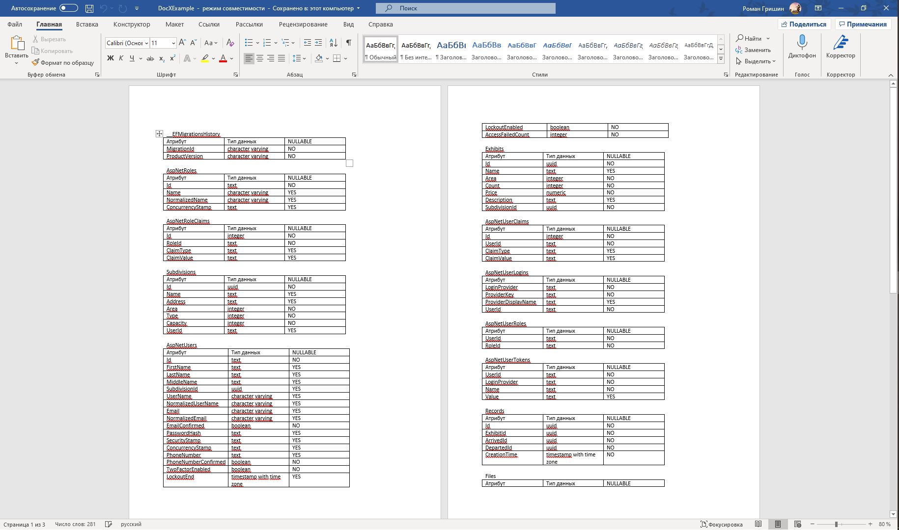

# dbTableBuilder

The application generates .docx file containing tables that describe the properties of the attributes of the entities of the PostgresSQL database.

## Run the application you need:
dotnet sdk 5.0.201

## Input args:
The console application accepts an array of strings as input => `string[] args`  
`args[0]` ConnectionString. Example: Host=localhost;Port=5432;Database=mems;User Id=grroma;Password=Q12345q  
`args[1]` FilePath. Example: C:\Users\oilhe\Desktop\dbTableBuilder\DocXExample.docx    
## Depends: 
Npgsql https://www.nuget.org/packages/Npgsql  
DocX https://www.nuget.org/packages/DocX  
DocumentFormat.OpenXml https://www.nuget.org/packages/DocumentFormat.OpenXml  
## Result example

